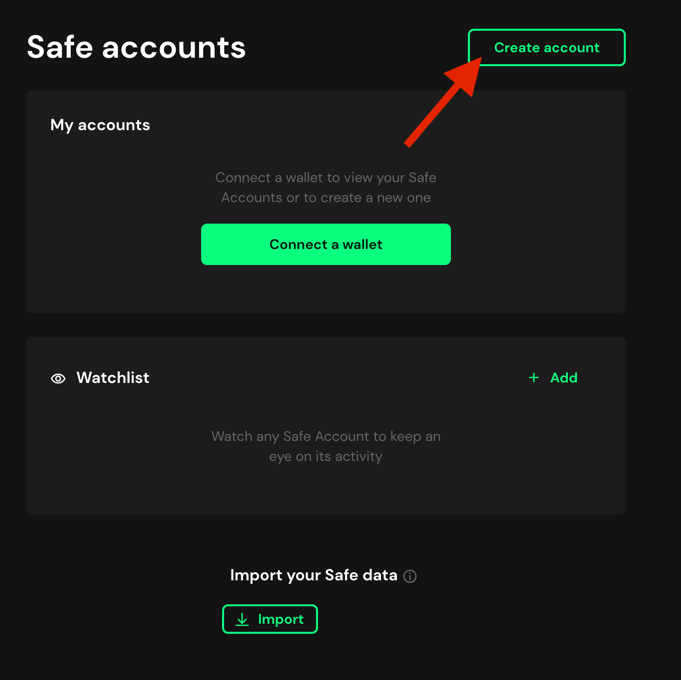
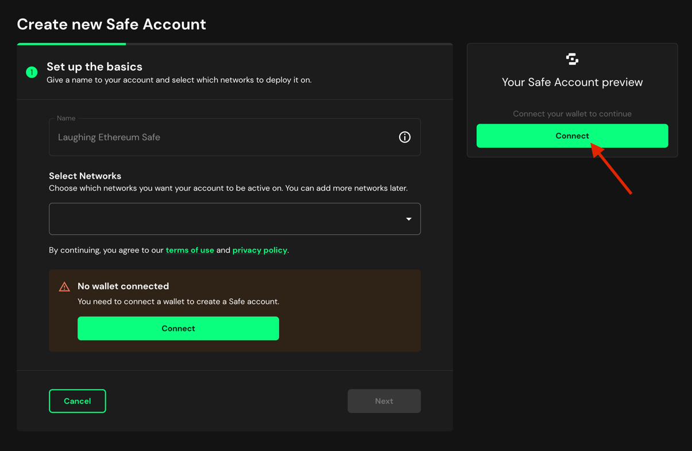
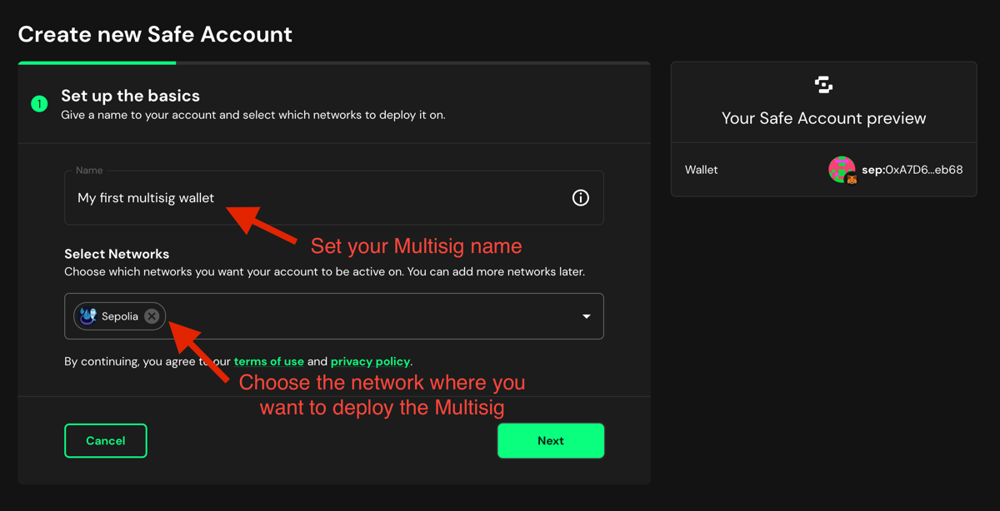
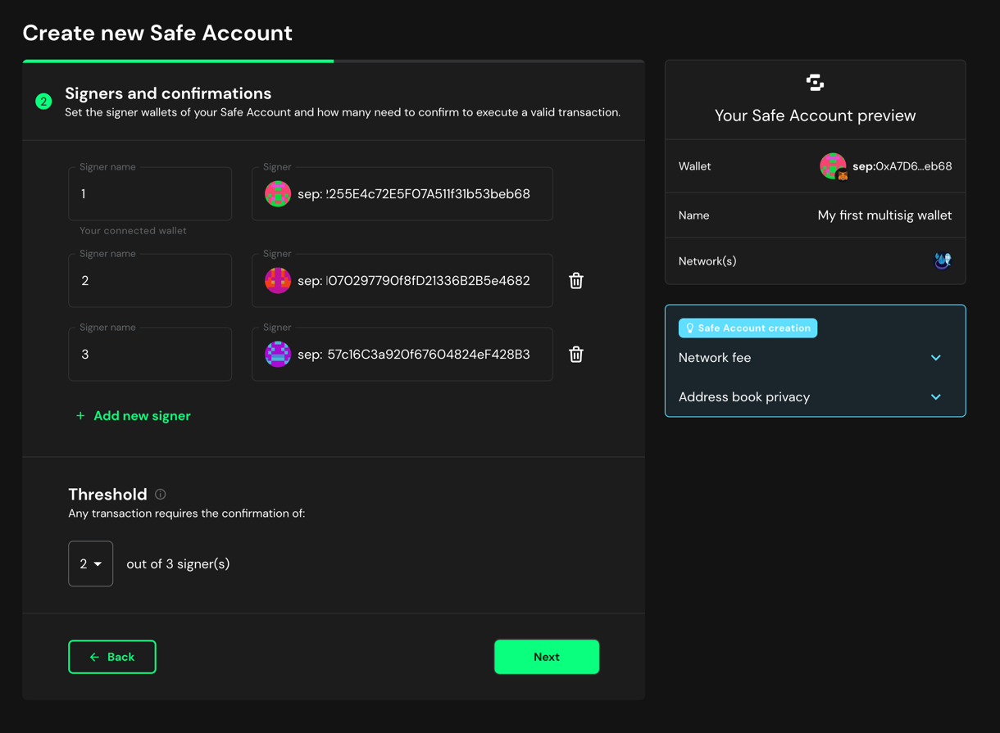
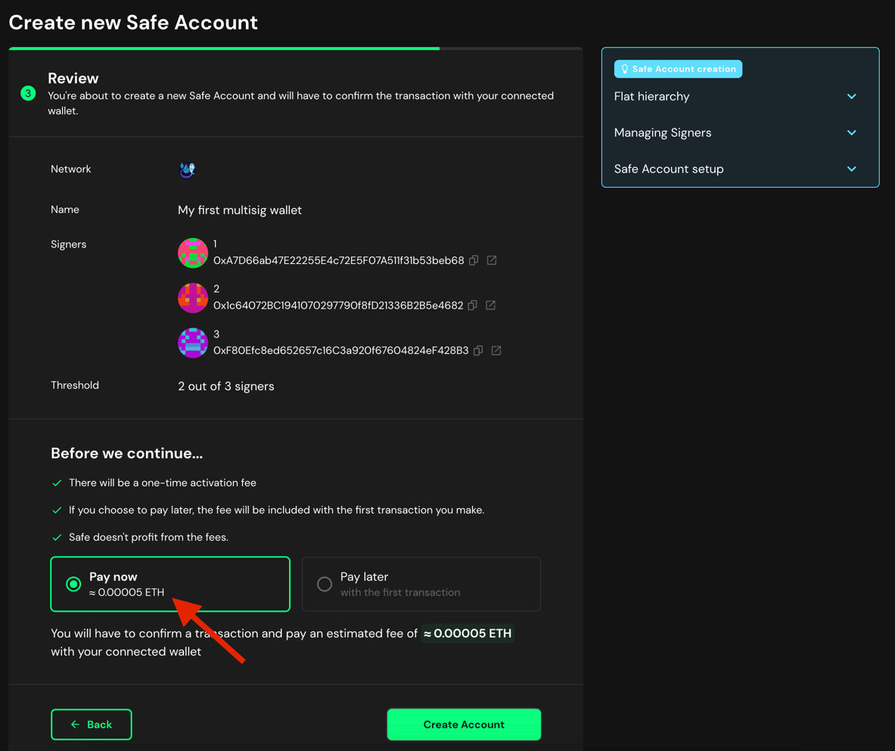
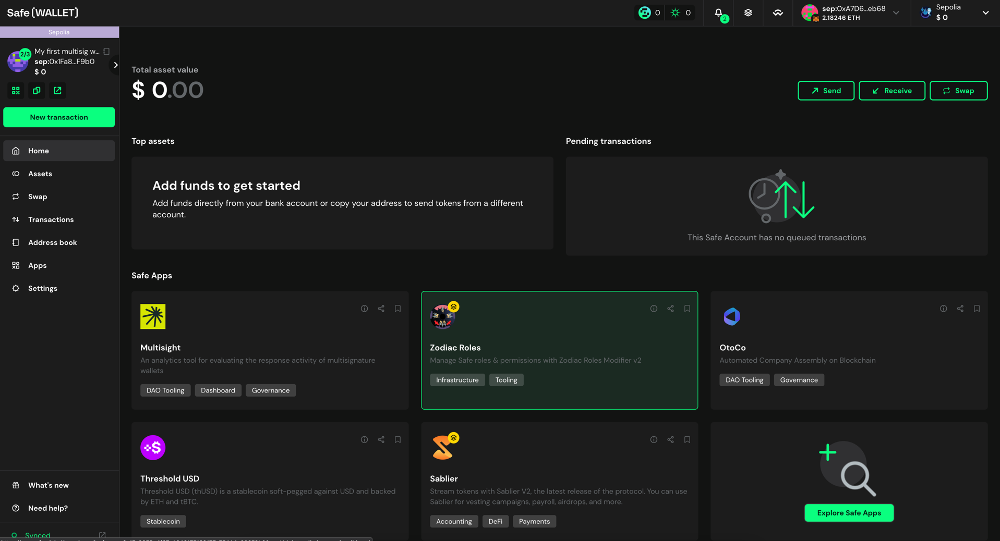

# Create a Multisig Wallet using SAFE

> [!WARNING]  
> Safe Multisig Wallet is not currently supported in Holesky Testnet.

> [!WARNING]  
> You need at least one wallet with funds to deploy the Multisig.

You can create a Multisig wallet using [Safe](https://safe.global/).

1. Go to [Safe](https://app.safe.global/welcome/accounts).

2. Click on `Create Account`.

    

3. Connect your wallet.

    

4. Set a name for your Multisig (it is just a local name) and choose a network where you want to deploy it. Then click on `Next`.

    
   
   For `Ethereum Sepolia` network set `Sepolia`.
   
   For `Ethereum Mainnet` network set `Ethereum`.

   In this tutorial, we are using `Sepolia` network.

5. Add the signers for your Multisig and the required threshold. Then click on `Next`.

    

   This example shows a 2/3 Multisig, which means that 2 out of 3 signers are required to approve a transaction.

6. Review the information, choose `Pay now` option and click on `Create Account`.

    

7. Confirm the transaction on your wallet.

8. Wait until the transaction is confirmed. Then, you will see your Multisig wallet.

    

After finishing this tutorial, you will have your Multisig wallet created. In this tutorial, we created a 
