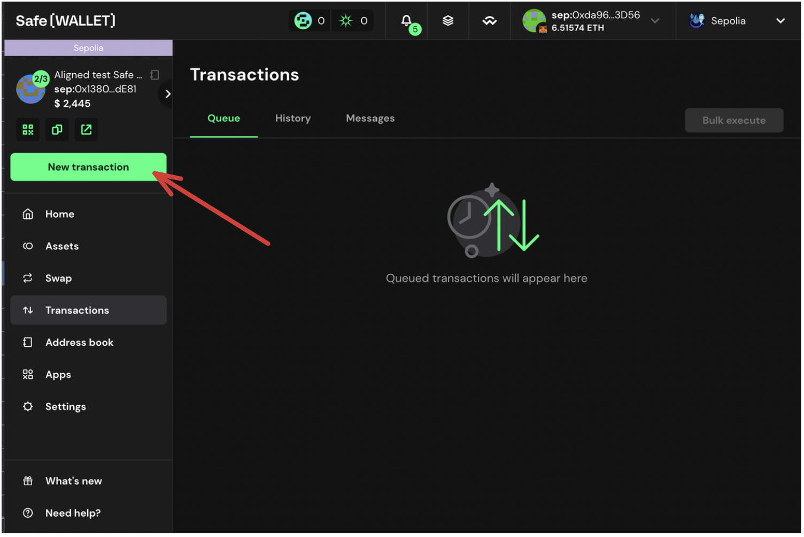
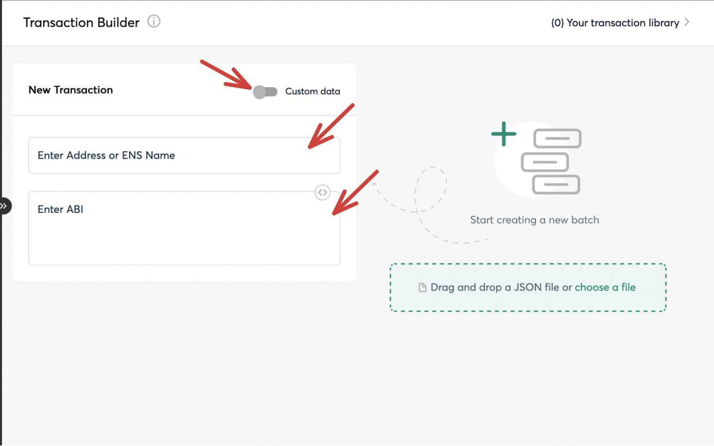
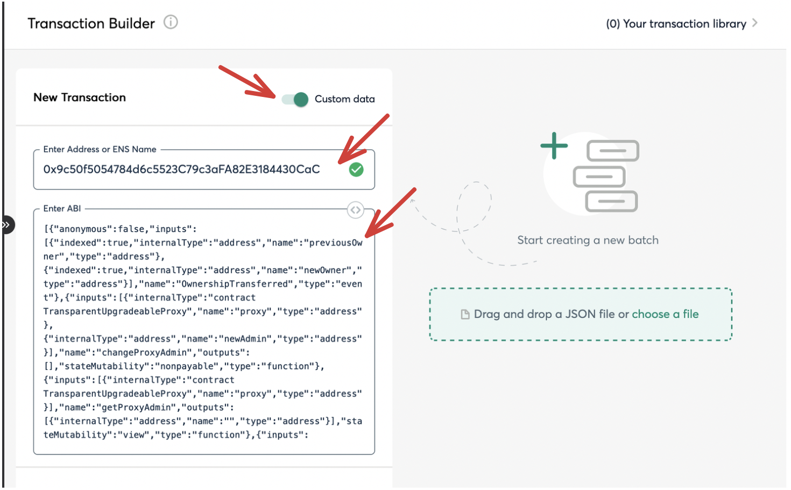
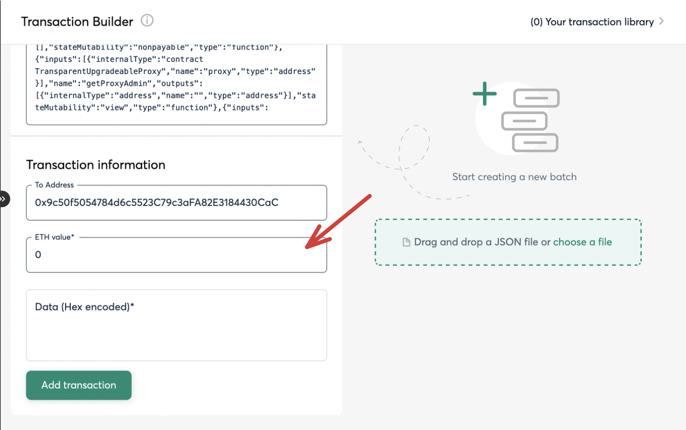
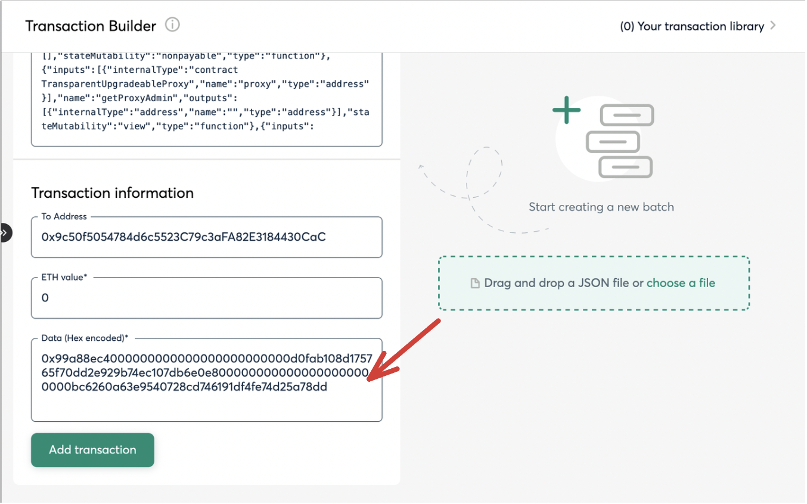
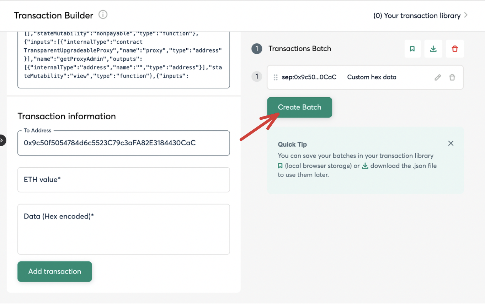
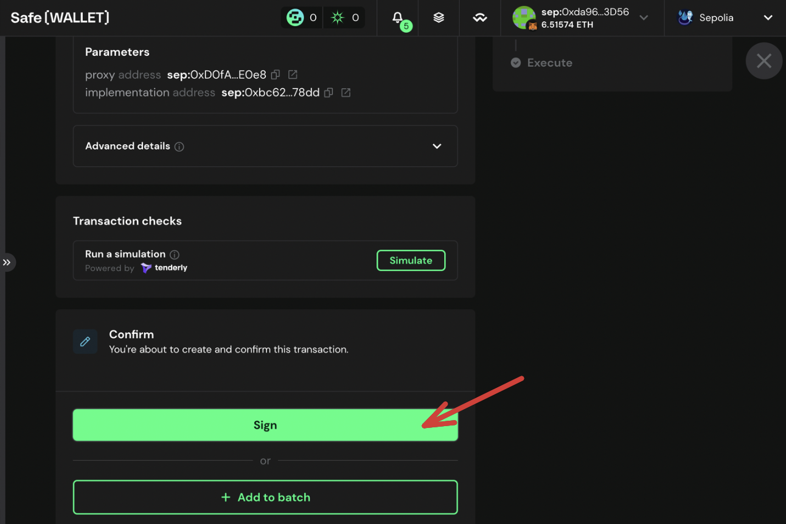
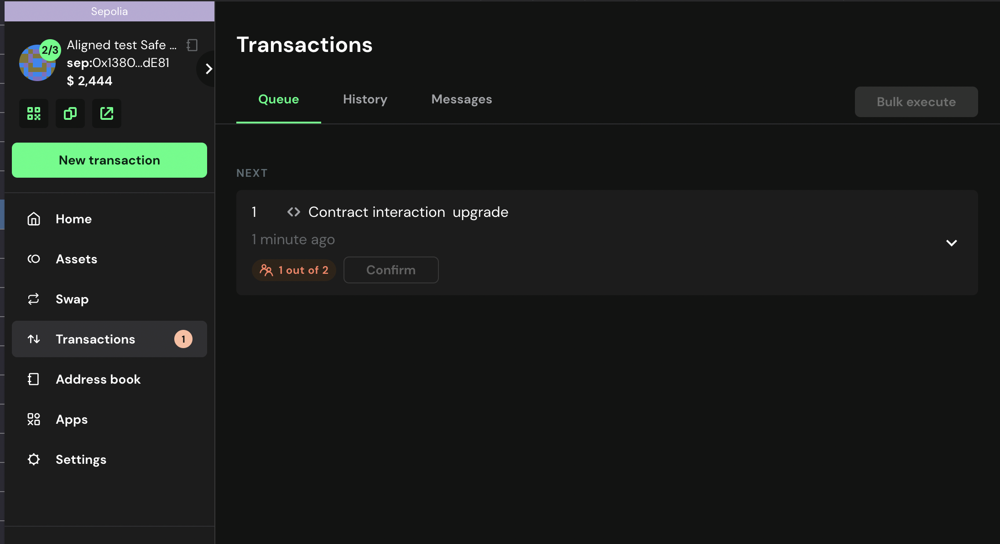

# Propose the Transaction for Upgrade using Multisig

After deploying a new implementation candidate for the upgrade, you need to propose the upgrade transaction using the multisig wallet.

## Propose transaction

To propose the upgrade transaction you can follow the steps below:

1. If you want to upgrade the ```alignedLayerServiceManager``` get the ```alignedLayerServiceManager``` and ```alignedServiceManagerImplementation``` address from ```contracts/script/output/mainnet/alignedlayer_deployment_output.json``` or ```contracts/script/output/holesky/alignedlayer_deployment_output.json``` or ```contracts/script/output/sepolia/alignedlayer_deployment_output.json```.
    
    If you want to upgrade the ```batcherPaymentService``` get the ```batcherPaymentServiceImplementation``` address from ```contracts/script/output/mainnet/alignedlayer_deployment_output.json``` or ```contracts/script/output/holesky/alignedlayer_deployment_output.json``` or ```contracts/script/output/sepolia/alignedlayer_deployment_output.json```.

2. If you want to upgrade the ```alignedLayerServiceManager``` generate the `calldata` for the upgrade transaction by running:

    ```bash
    cast calldata "upgrade(address, address)" <alignedLayerServiceManager> <alignedLayerServiceManagerImplementation>
    ```
   
    If you want to upgrade the ```batcherPaymentService``` generate the `calldata` for the upgrade transaction by running:

    ```bash
   cast calldata "upgradeTo(address)" <batcherPaymentServiceImplementation>
   ```

3. Verify the contract bytecode running the following command:

   ```
   TODO
   ```
   
4. Once the proposed upgrade is validated, you can create the upgrade transaction on [Safe](https://app.safe.global/home)

5. Click on `New transaction` -> `Transaction Builder`
   
   

   

6. Enable `Custom data`

7. Get the `ProxyAdmin` address from ```contracts/script/output/mainnet/alignedlayer_deployment_output.json``` or ```contracts/script/output/holesky/alignedlayer_deployment_output.json``` or ```contracts/script/output/sepolia/alignedlayer_deployment_output.json```, and paste it on `Enter Address or ENS Name`

8. Once you paste the `ProxyAdmin` address, the ABI should be automatically filled.

      

      

9. Set the `ETH Value` as 0

      

10. Paste the calldata obtained from the deployment of the new implementation on the `Data` box and click on `+ Add new transaction`.

      

      You should see the new transaction to be executed on the right side.

11. Click on `Create batch` to create the transaction.

      

12. Review and confirm the transaction.
   
      To make sure everything is fine, simulate the transaction by clicking on `Simulate batch`
   
      Once the simulation is successful, click on `Send Batch` to send the transaction.

      

13. Confirm the transaction checking the function being called is correct and the contract address is the one you deployed.

      If everything is correct, click on `Sign` to send the transaction.

      

14. Now in your transactions, you should be able to see the newly created transaction.

      

15. If the transaction is correctly created, you have to wait until the required Multisig member signs the transaction to send it.

A guide on how to sign the transaction can be found [here](./3_b_3_approve_upgrade.md)
