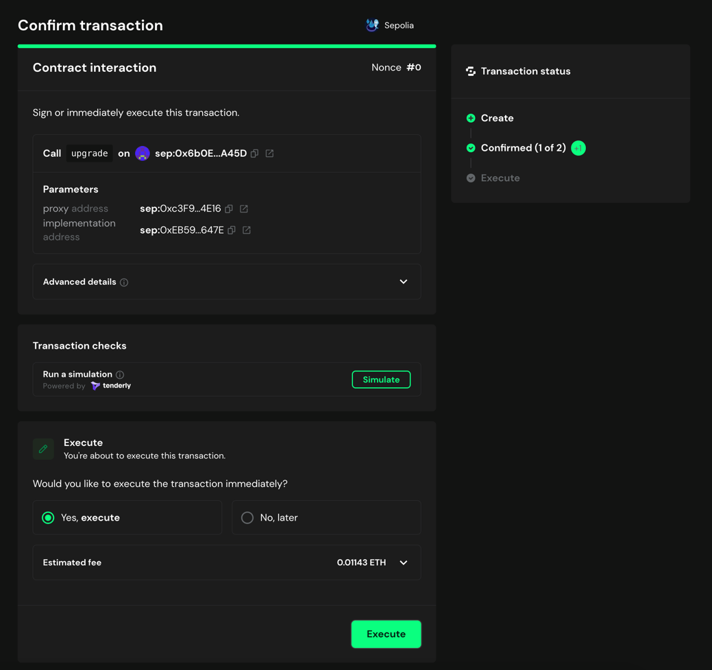

# Approve the Upgrade

Once the transaction is proposed, the multisig owners must approve the transaction.

## Prerequisites

- One of the multisig owners must have proposed the upgrade transaction using the `calldata` obtained from the deployment of the new implementation.

## Approve the Upgrade

To approve the upgrade transaction, you can follow the steps below:

1. Go to [Safe](https://app.safe.global/home) and connect your wallet.

2. Go to the `Transactions` tab and find the transaction that was proposed.

3. Click on the transaction and validate the data is correct. 

   If you are upgrading the AlignedLayerServiceManager or the RegistryCoordinator, the called function must be `upgrade(address, address)`.

   Else, if you are upgrading the BatcherPaymentService, the called function must be `upgradeTo(address)`.

   Also check contract addresses are the ones you received from the deployment.

   

4. If data is correct, click on `Confirm` and sign the transaction.

   

5. Revalidate the transaction data and simulate the transaction to check everything is correct.

   

6. Once you are sure everything is correct, click on `Execute` to approve the transaction.

> [!NOTE]
> The transaction gas usage is approximately 100,000 gas units. Make sure you have enough ETH to cover the gas fees.

### Notes on Trezor usages

If you are using a Trezor wallet, you may encounter an issue where the transaction is not executed. This error can be fixed with the following change in the Trezor configuration https://forum.trezor.io/t/how-to-fix-error-forbidden-key-path/8642.

In the Trezor screen you have to check the `safeTxHash` is the same as the shown in the Safe UI

7. Wait for the transaction to be executed. You can check the transaction status on the `Transactions` tab.

8. Once the multisig threshold is reached, the transaction will be executed and the contract will be upgraded.

   
