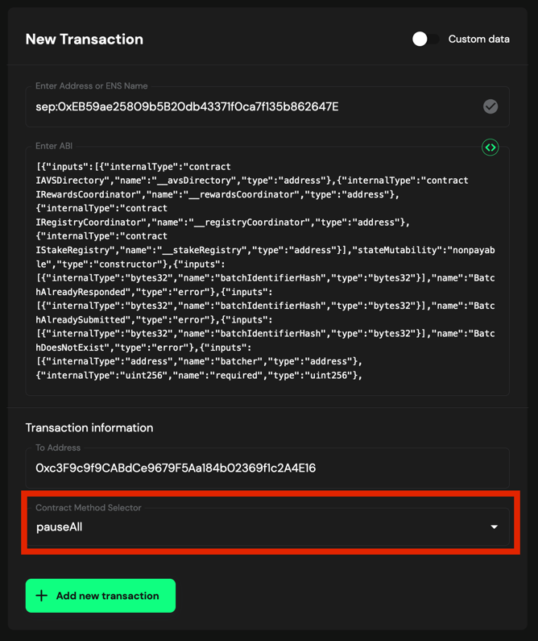

# Propose the Transaction for Pause using Multisig

If you want to pause the contracts, you can propose the pause transaction using the multisig wallet.

## Prerequisites

- You need to have deployed the contracts following the [Deploy Contracts Guide](./2_deploy_contracts.md).

## Propose transaction for Pause AlignedLayerServiceManager

To propose the pause transaction you can follow the steps below:

1. Create the pause transaction on [Safe](https://app.safe.global/home)

2. Click on `New transaction` -> `Transaction Builder`

   

   

3. . Enable `Custom data`

4. . Get the `AlignedLayerServiceManager` address:

    ```bash
   # SEPOLIA
   jq -r ".addresses.alignedLayerServiceManager" contracts/script/output/sepolia/alignedlayer_deployment_output.json | pbcopy
    ```

    ```bash
   # HOLESKY
   jq -r ".addresses.alignedLayerServiceManager" contracts/script/output/holesky/alignedlayer_deployment_output.json | pbcopy
    ```

    ```bash
    # MAINNET
    jq -r ".addresses.alignedLayerServiceManager" contracts/script/output/mainnet/alignedlayer_deployment_output.json | pbcopy
    ```

>    [!NOTE]
>    Make sure to set the path to the correct deployment output file.

5. Paste the `AlignedLayerServiceManager` address on `Enter Address or ENS Name`

   

6. Set the `ETH Value` to 0.

7. . Generate the function calldata

    ```bash
    cast calldata "pauseAll()"
    ```

    This will show the `pauseAll()` calldata: `0x595c6a67`.

8. Paste the `calldata` on `Enter Data`

   

9. Click on `+ Add new transaction`

   You should see the new transaction to be executed

10. Click on `Create batch` to create the transaction.

11. Simulate the transaction by clicking on `Simulate`

12. Check the data matches with the generated data on step 7.

   

13. If everything is correct, click on `Send batch` to send the transaction.

14. Simulate the transaction, and if everything is correct, click on `Sign`.

   

> [!NOTE]
> In the `call` field, you will see `fallback`.

15. Wait for the transaction to be executed. You can check the transaction status on the `Transactions` tab.


## Propose transaction for Pause BatcherPaymentService

To propose the pause transaction you can follow the steps below:

1. Create the pause transaction on [Safe](https://app.safe.global/home)

2. Click on `New transaction` -> `Transaction Builder`

   

   

3. . Get the `BatcherPaymentService` address:

    ```bash
   # SEPOLIA
   jq -r ".addresses.batcherPaymentService" contracts/script/output/sepolia/alignedlayer_deployment_output.json | pbcopy
    ```

    ```bash
   # HOLESKY
   jq -r ".addresses.batcherPaymentService" contracts/script/output/holesky/alignedlayer_deployment_output.json | pbcopy
    ```

    ```bash
    # MAINNET
    jq -r ".addresses.batcherPaymentService" contracts/script/output/mainnet/alignedlayer_deployment_output.json | pbcopy
    ```

>    [!NOTE]
>    Make sure to set the path to the correct deployment output file.

5. Paste the `BatcherPaymentService` address on `Enter Address or ENS Name`

   

6. As this is a Proxy contract, choose `Use Implementation ABI`

   

7. In `contract method selector` choose `pause()`

   

8. Then click on `+ Add new transaction`

   You should see the new transaction to be executed. Then click on `Create batch` to create the transaction.

   

9. Review and confirm you are interacting with the correct `BatcherPaymentService` contract and you are calling the `pause` function.

   

10. Simulate the transaction by clicking on `Simulate`

11. If everything is correct, click on `Send batch` to send the transaction.

12. Review the transaction and click on `Sign` to sign the transaction.

   

13. If the transaction is correctly created, you have to wait until the required Multisig member signs the transaction to send it.
