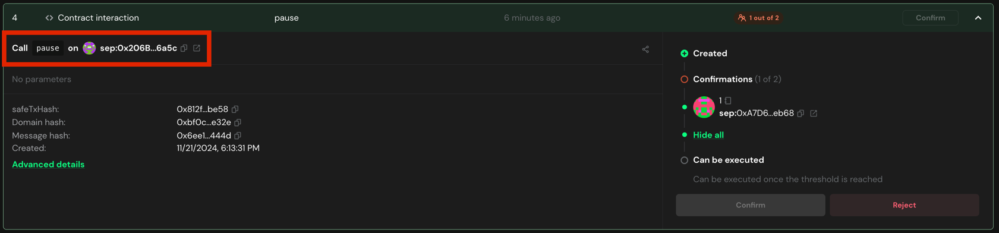

# Approve the Pause Transaction

Once the transaction is proposed, the multisig owners must approve the transaction.

## Prerequisites

- One of the multisig owners must have proposed the pause transaction.

## Approve the Pause for AlignedLayerServiceManager

To approve the pause transaction, you can follow the steps below:

1. Go to [Safe](https://app.safe.global/home) and connect your wallet.

2. Go to the `Transactions` tab and find the transaction that was proposed.

3. Click on the transaction and validate the data is correct. 

    The called function must be `pauseAll()`.

    Also check contract addresses are the ones you received from the deployment.

    

[//]: # (TODO finish it has a bug)

## Approve the Pause for BatcherPaymentService

To approve the pause transaction, you can follow the steps below:

1. Go to [Safe](https://app.safe.global/home) and connect your wallet.

2. Go to the `Transactions` tab and find the transaction that was proposed.

3. Click on the transaction and validate the data is correct. 

    The called function must be `pause` and the contract address must be the `BatcherPaymentService` address.

   

   You can get the `BatcherPaymentService` address:

    ```bash
   # SEPOLIA
   jq -r ".addresses.batcherPaymentService" contracts/script/output/sepolia/alignedlayer_deployment_output.json | pbcopy
    ```

    ```bash
   # HOLESKY
   jq -r ".addresses.batcherPaymentService" contracts/script/output/holesky/alignedlayer_deployment_output.json | pbcopy
    ```

    ```bash
    # MAINNET
    jq -r ".addresses.batcherPaymentService" contracts/script/output/mainnet/alignedlayer_deployment_output.json | pbcopy
    ```

>    [!NOTE]
>    Make sure to set the path to the correct deployment output file.

4. If the data is correct, click on the `Confirm` button.

5. Simulate the transaction. If everything is correct, click on the `Sign` button.

   

6. Once the transaction is executed, the pause will be effective.

   You can check the pause status on Etherscan by checking the `paused` variable of the contract.

   