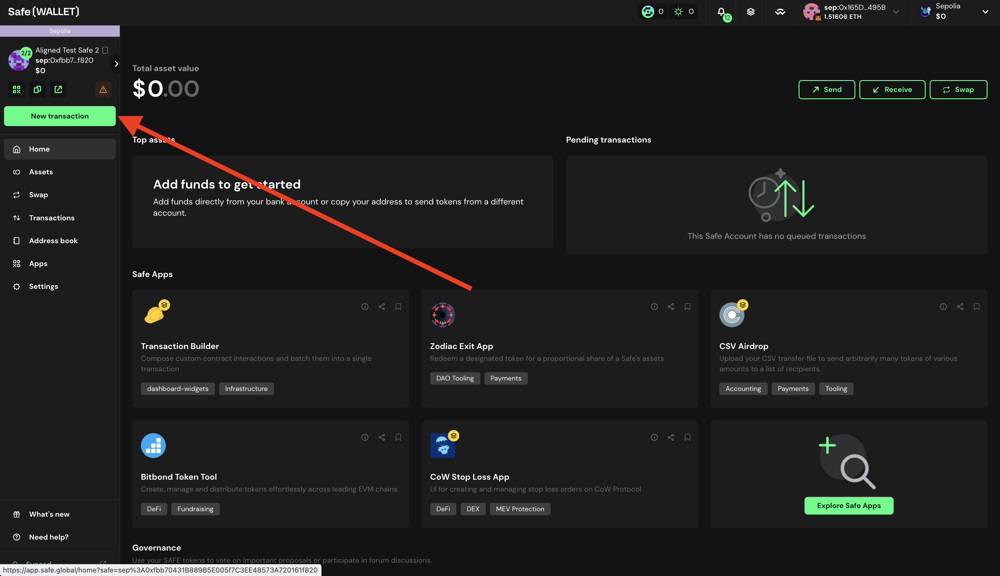
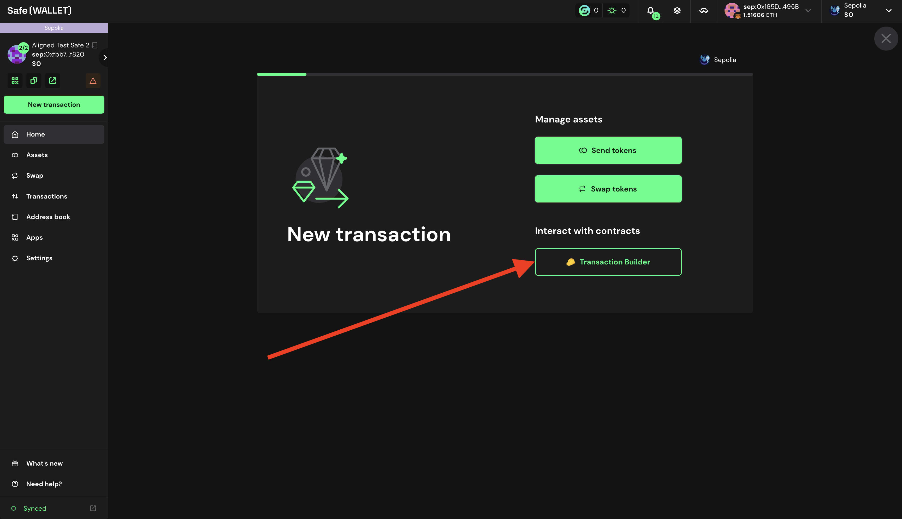
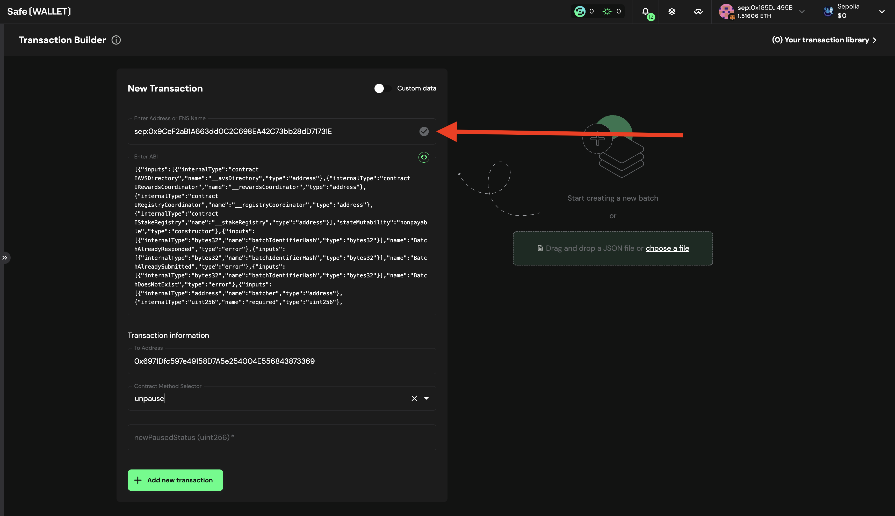
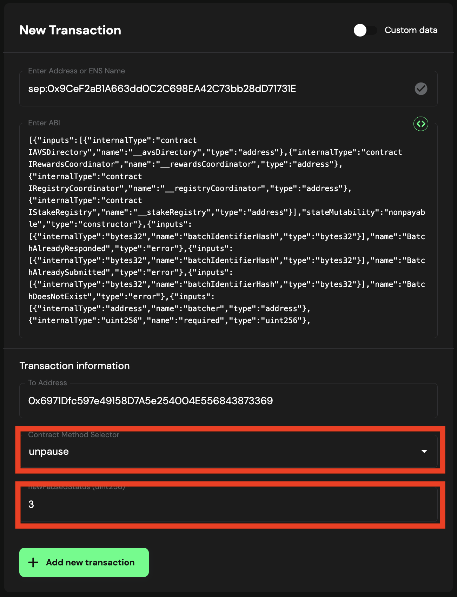
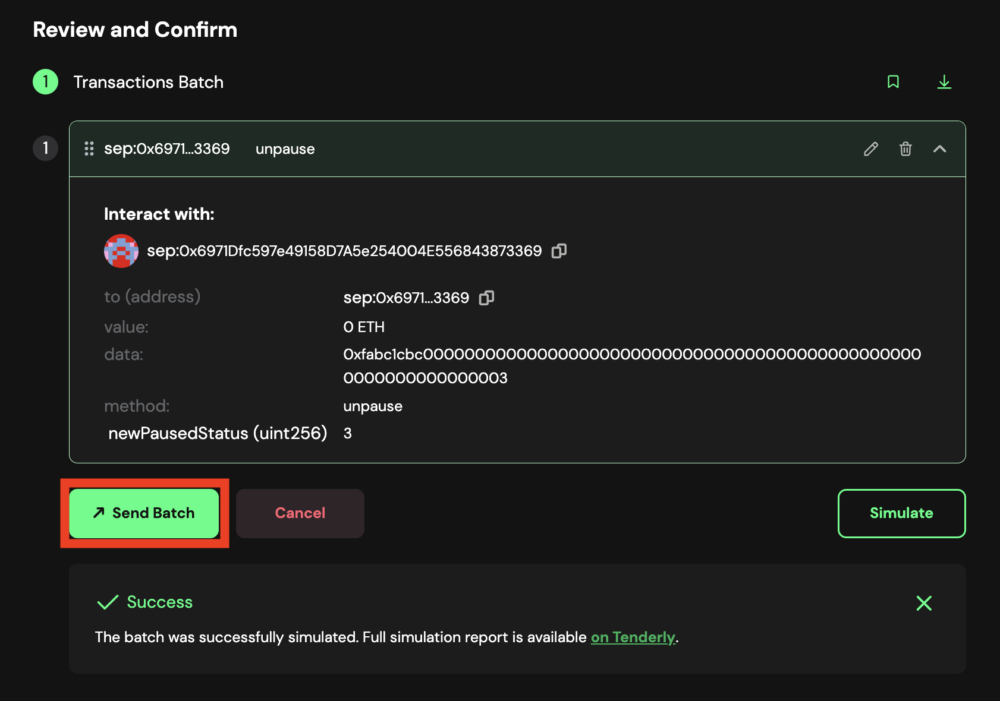
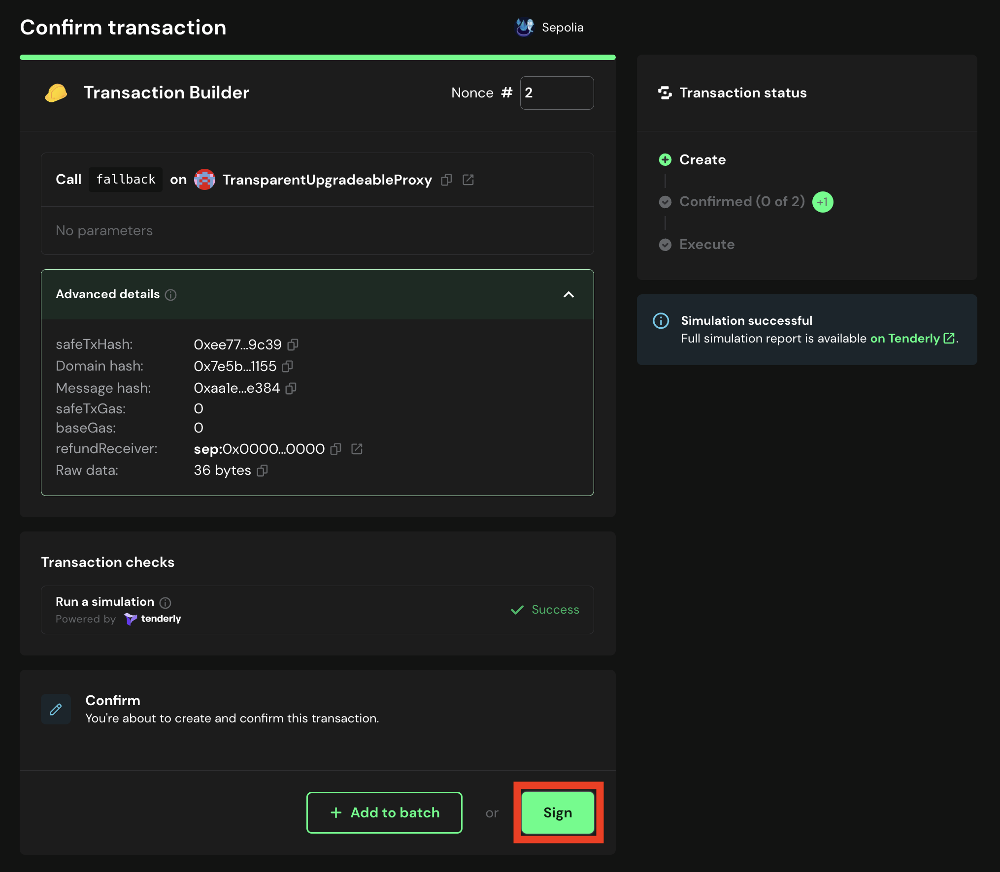
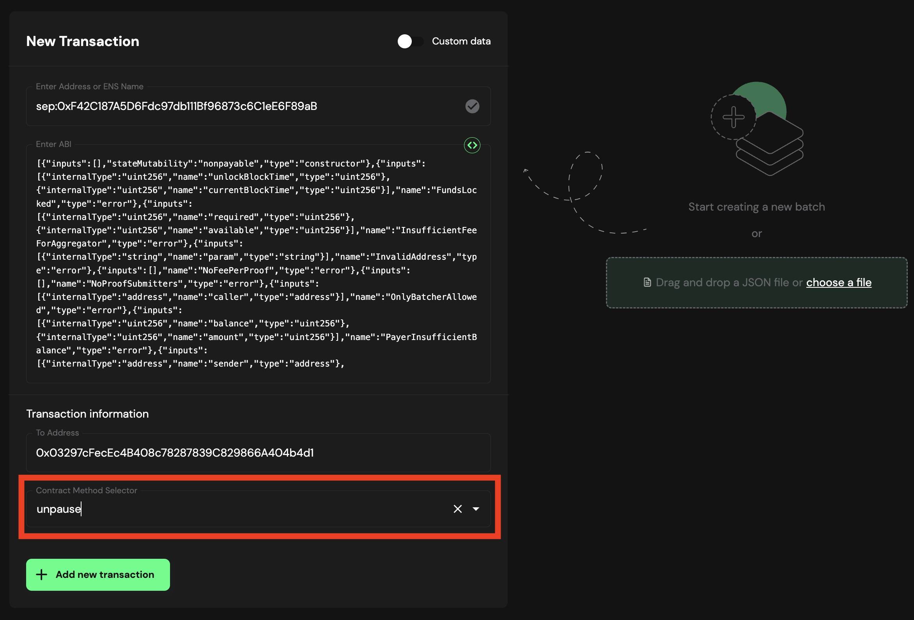
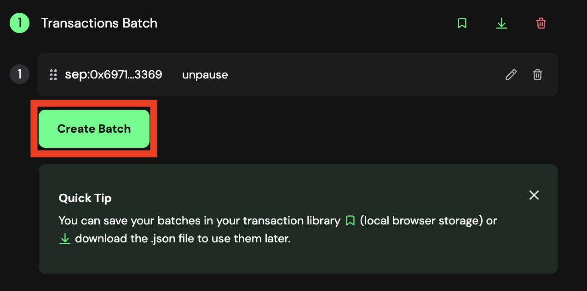
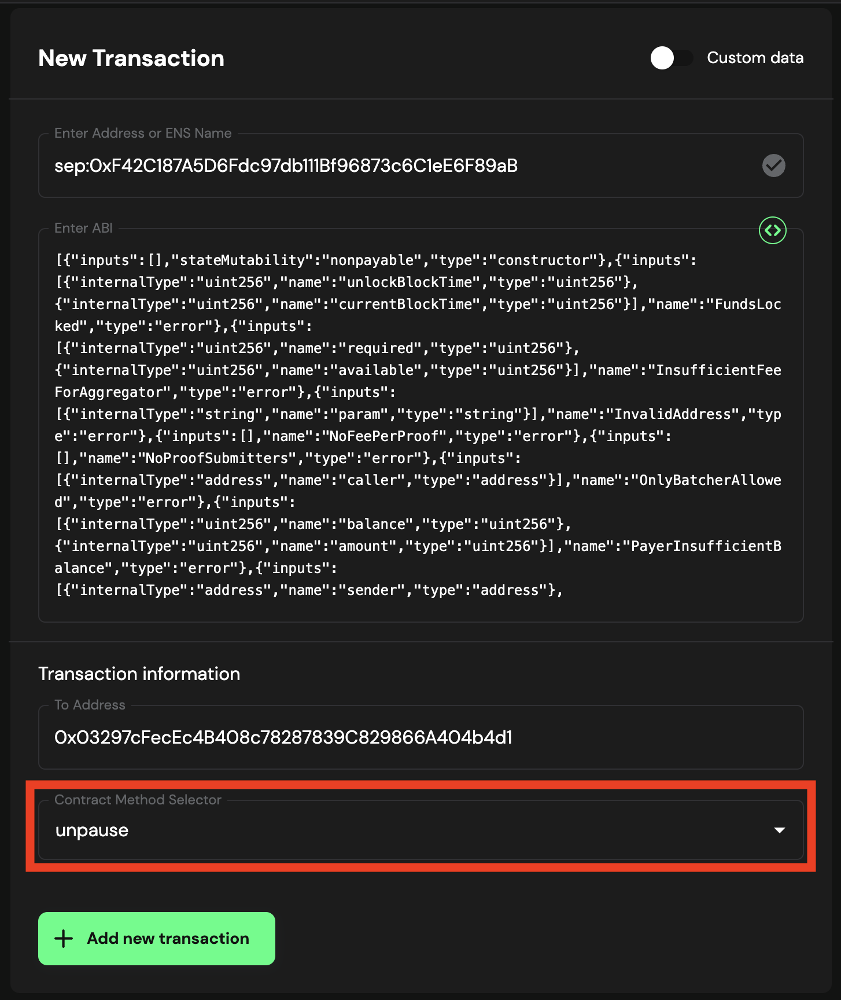
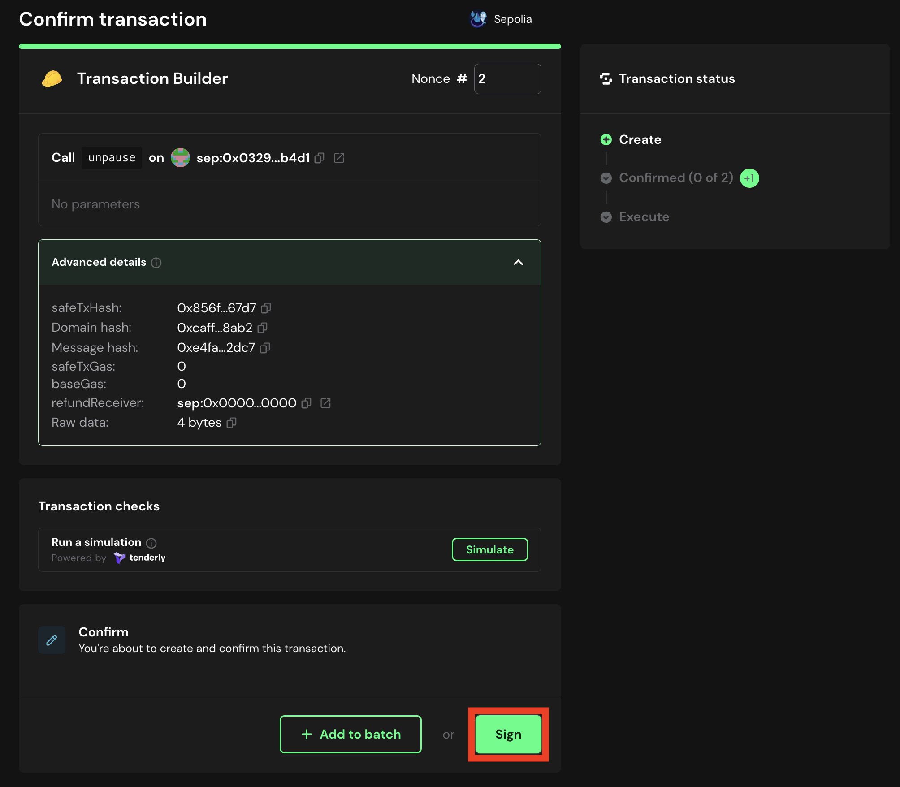

# Propose the Transaction for UnPause using Multisig

If you want to unpause the contracts, you can propose the unpause transaction using the multisig wallet.

## Prerequisites

- You need to have deployed the contracts following the [Deploy Contracts Guide](./2_deploy_contracts.md).

## Propose transaction for UnPause AlignedLayerServiceManager

To propose the unpause transaction you can follow the steps below:

1. Go to [Safe](https://app.safe.global/home)

2. Click on `New transaction` -> `Transaction Builder`

   

   

3. . Get the `AlignedLayerServiceManager` address from ```contracts/script/output/mainnet/alignedlayer_deployment_output.json``` or ```contracts/script/output/holesky/alignedlayer_deployment_output.json``` or ```contracts/script/output/sepolia/alignedlayer_deployment_output.json```

4. Paste the `AlignedLayerServiceManager` address on `Enter Address or ENS Name`

   

5. As this is a Proxy contract, choose `Use Implementation ABI`

   

6. In `contract method selector` choose `unpause()` and within `newPausedStatus(uint256)` enter the desired pause status as described in [pausable.md](./pausable.md)

   

7. Click on `+ Add new transaction`

   You should see the new transaction to be executed

8. Click on `Create batch` to create the transaction.

   

9. Simulate the transaction by clicking on `Simulate`

10. If everything is correct, click on `Send batch` to send the transaction.

11. Simulate the transaction, and if everything is correct, click on `Sign`.

   

> [!NOTE]
> In the `call` field, you will see `fallback`.
12. Wait for the transaction to be executed. You can check the transaction status on the `Transactions` tab.


## Propose transaction for UnPause BatcherPaymentService

To propose the unpause transaction you can follow the steps below:

1. Create the unpause transaction on [Safe](https://app.safe.global/home)

2. Click on `New transaction` -> `Transaction Builder`

   

   

3. Get the `BatcherPaymentService` address from ```contracts/script/output/mainnet/alignedlayer_deployment_output.json``` or ```contracts/script/output/holesky/alignedlayer_deployment_output.json``` or ```contracts/script/output/sepolia/alignedlayer_deployment_output.json```

4. Paste the `BatcherPaymentService` address on `Enter Address or ENS Name`

   

5. As this is a Proxy contract, choose `Use Implementation ABI`

   

6. In `contract method selector` choose `unpause()` 

   

7. Then click on `+ Add new transaction`

   You should see the new transaction to be executed. Then click on `Create batch` to create the transaction.

   

8. Review and confirm you are interacting with the correct `BatcherPaymentService` contract and you are calling the `unpause` function.

   

9. Simulate the transaction by clicking on `Simulate`

10. If everything is correct, click on `Send batch` to send the transaction.

11. Review the transaction and click on `Sign` to sign the transaction.

   

12. If the transaction is correctly created, you have to wait until the required Multisig member signs the transaction to send it.