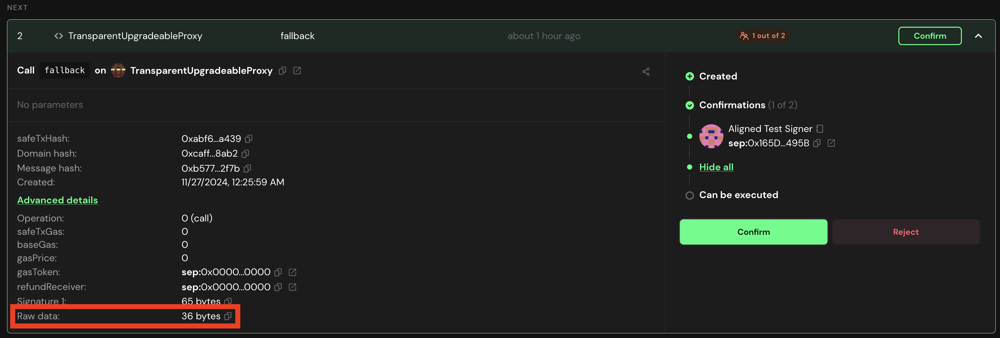
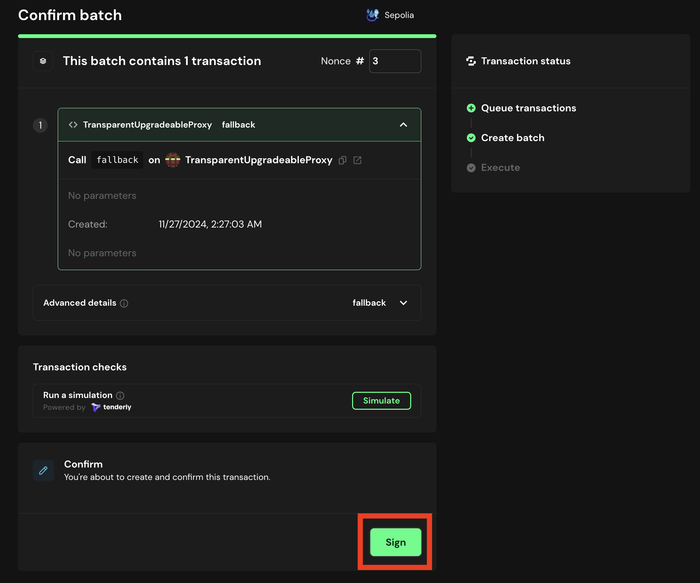
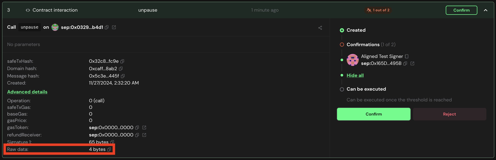
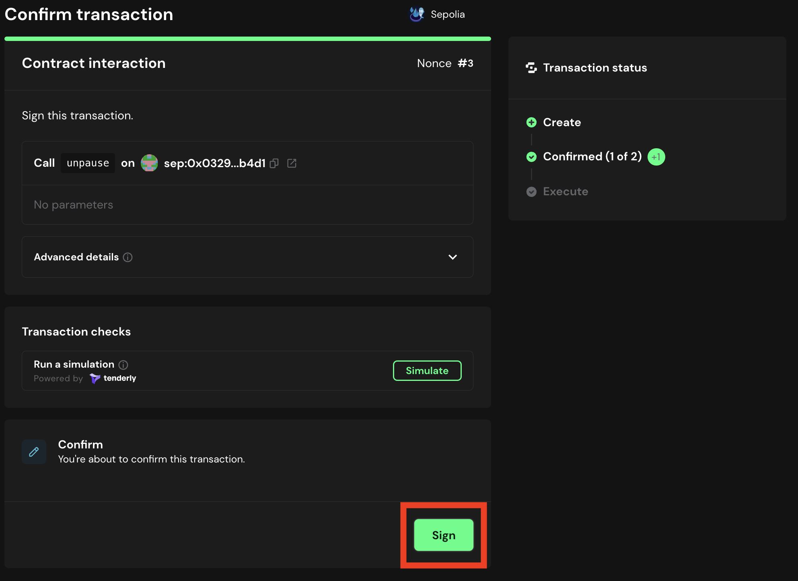

# Approve the UnPause Transaction

Once the transaction is proposed, the multisig owners must approve the transaction.

## Approve the UnPause for AlignedLayerServiceManager

1. Go to [Safe](https://app.safe.global/home) and connect your wallet.

2. Go to the `Transactions` tab and find the transaction that was proposed.

3. Get the ```unpause(uint256)``` signature by running:

   ```bash
   cast calldata "unpause(uint256) <PAUSE_STATE>" 
   ```

   for ```PAUSE_STATE=3```

   It must show you ```0xfabc1cbc0000000000000000000000000000000000000000000000000000000000000003```, with ```0xfabc1cbc``` being the function identifier.

4. Click on the transaction, and then click on ```Advanced Details```.

    

5. Copy the ```Raw Data```, paste it in a text editor and verify it is the same value as the one you got in step 3.

6. If the data is correct, click on the `Confirm` button.

7. Simulate the transaction. If everything is correct, click on the `Sign` button.

   

8. Once the transaction is executed, the unpause will be effective.

## Approve the UnPause for BatcherPaymentService

1. Go to [Safe](https://app.safe.global/home) and connect your wallet.

2. Go to the `Transactions` tab and find the transaction that was proposed.

3. Click on the transaction and validate the data is correct. 

    The called function must be `unpause()` and the contract address must be the `BatcherPaymentService` address.

   

   Get the `BatcherPaymentService` address from ```contracts/script/output/mainnet/alignedlayer_deployment_output.json``` or ```contracts/script/output/holesky/alignedlayer_deployment_output.json``` or ```contracts/script/output/sepolia/alignedlayer_deployment_output.json```

4. If the data is correct, click on the `Confirm` button.

5. Simulate the transaction. If everything is correct, click on the `Sign` button.

   

6. Once the transaction is executed, the unpause will be effective.