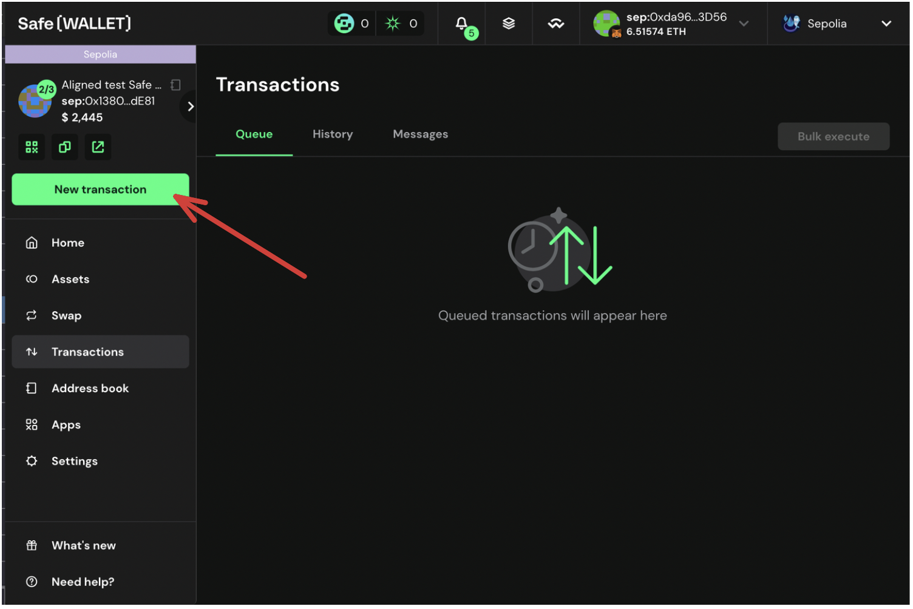
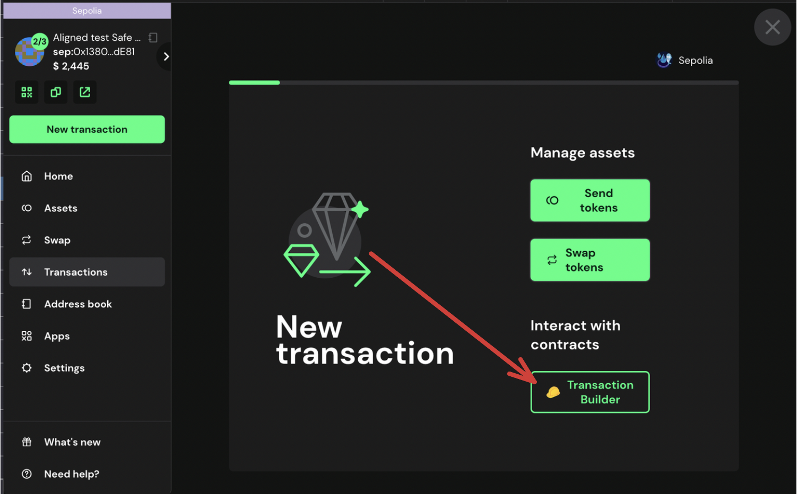

# Propose the Transaction for Pause using Multisig

If you want to Whitelist Operators, you can propose the pause transaction using the multisig wallet.

## Prerequisites

- You need to have deployed the contracts following the [Deploy Contracts Guide](./2_deploy_contracts.md).

## Propose transaction for Whitelist Operators

To propose the pause transaction you can follow the steps below:

1. Go to [Safe](https://app.safe.global/home)

2. Click on `New transaction` -> `Transaction Builder`

   

   

3. . Get the `registryCoordinator` address from ```contracts/script/output/mainnet/alignedlayer_deployment_output.json``` or ```contracts/script/output/holesky/alignedlayer_deployment_output.json``` or ```contracts/script/output/sepolia/alignedlayer_deployment_output.json```

4. Paste the `registryCoordinator` address on `Enter Address or ENS Name` , and turn on the `Custom Data` flag.

   

5. In `Data` field paste the Data generated previously. Also check the `To Address` is the correct `registryCoordinator` address, and the `ETH value`

    

7. Click on `+ Add new transaction`

   You should see the new transaction to be executed

   

8. Click on `Create batch` to create the transaction.

   

9.  Simulate the transaction by clicking on `Simulate`

   

10. If everything is correct, click on `Send batch` to send the transaction.

11. Simulate the transaction, and if everything is correct, click on `Sign`.

   

> [!NOTE]
> In the `call` field, you will see `fallback`.

12. Wait for the transaction to be executed. You can check the transaction status on the `Transactions` tab.

13. If the transaction is correctly created, you have to wait until the required Multisig member signs the transaction to send it. For this, you can follow [the following guide](./5_b_2_approve_whitelist.md)
