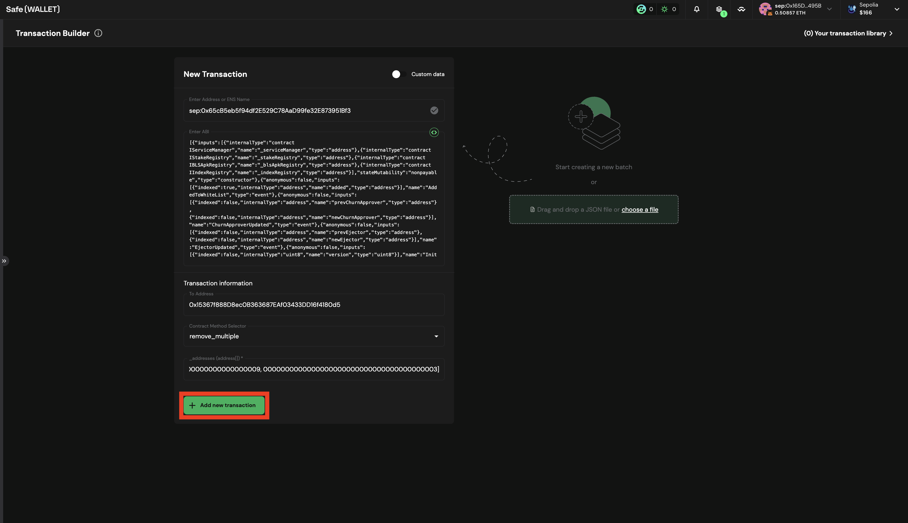

# Propose the Transaction for Removing Operators using Multisig

If you want to Removing Operators, you can propose the remove operator transaction using the multisig wallet.

## Prerequisites

- You need to have deployed the contracts following the [Deploy Contracts Guide](./2_deploy_contracts.md).

## Propose transaction for Removing Operators

To propose a remove operator from whitelist transaction you can follow the steps below:

#### 1. Go to [Safe](https://app.safe.global/home)

#### 2. Click on `New transaction` -> `Transaction Builder`

   

   

#### 3. Get the `registryCoordinator` address from ```contracts/script/output/mainnet/alignedlayer_deployment_output.json``` or ```contracts/script/output/holesky/alignedlayer_deployment_output.json``` or ```contracts/script/output/sepolia/alignedlayer_deployment_output.json```

#### 4. Paste the `registryCoordinator` address on `Enter Address or ENS Name`

   

#### 5. As this is a Proxy contract, choose `Use Implementation ABI`

   

If `Use Implementation ABI`, did not show up you will need to submit the call via raw calldata. Consult this this alternative [guide](./5_b_3b_propose_remove_operator_with_call_data.md)
   
#### 6. In `contract method selector` choose `remove_multiple()` in the `_addresses(address[])` field, enter the operator addresses in the following format `[<OPERATOR_ADDRESS>, ..., <OPERATOR_ADDRESS>]` for example, `[0000000000000000000000000000000000000009, 0000000000000000000000000000000000000003]`

   

7. Click on `+ Add new transaction`

   You should see the new transaction to be executed

   

8. Click on `Create Batch` to create the transaction.

   

9.  Simulate the transaction by clicking on `Simulate`

   

10. If everything is correct, click on `Send batch` to send the transaction.

11. Simulate the transaction, and if everything is correct, click on `Sign`.

   

12. Wait for the transaction to be executed. You can check the transaction status on the `Transactions` tab.

13. If the transaction is correctly created, you have to wait until the required Multisig member signs the transaction to send it. For this, you can follow [the following guide](./5_b_4_approve_remove_operator.md)
