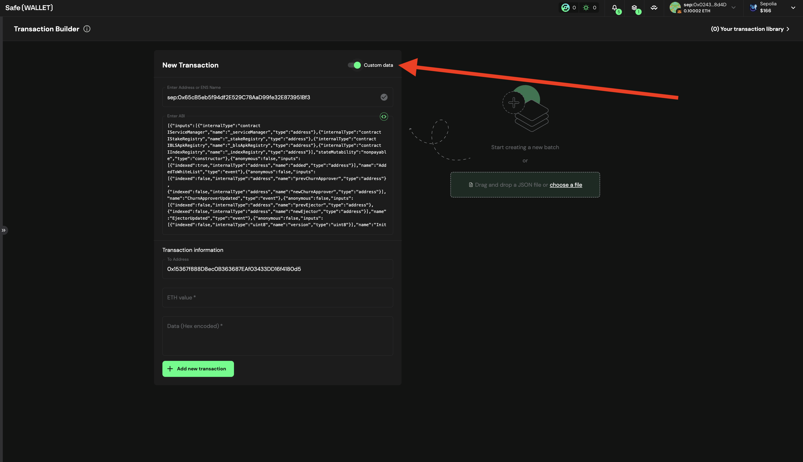

Turn on the `Custom Data` flag.
     

Generate the call data for function to white list an operator ```remove_multiple(address[])``` by running:

```bash
cast calldata "remove_multiple(address[])" "[<OPERATOR_ADDRESS>, ...]"
```

For example:
```bash
cast calldata "remove_multiple(address[])" "[0x0000000000000000000000000000000000000009, 0x0000000000000000000000000000000000000003]"
```

will display ```0x53abfad40000000000000000000000000000000000000000000000000000000000000020000000000000000000000000000000000000000000000000000000000000000200000000000000000000000000000000000000000000000000000000000000090000000000000000000000000000000000000000000000000000000000000003```

Confirm the calldata starts with the correct function identifier ```0x53abfad4```.

In `Data` field paste the previously generated call data. Also check the `To Address` is the correct `registryCoordinator` address, and the `ETH value` should be set to `0`.

    
