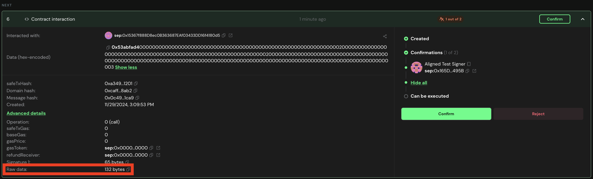
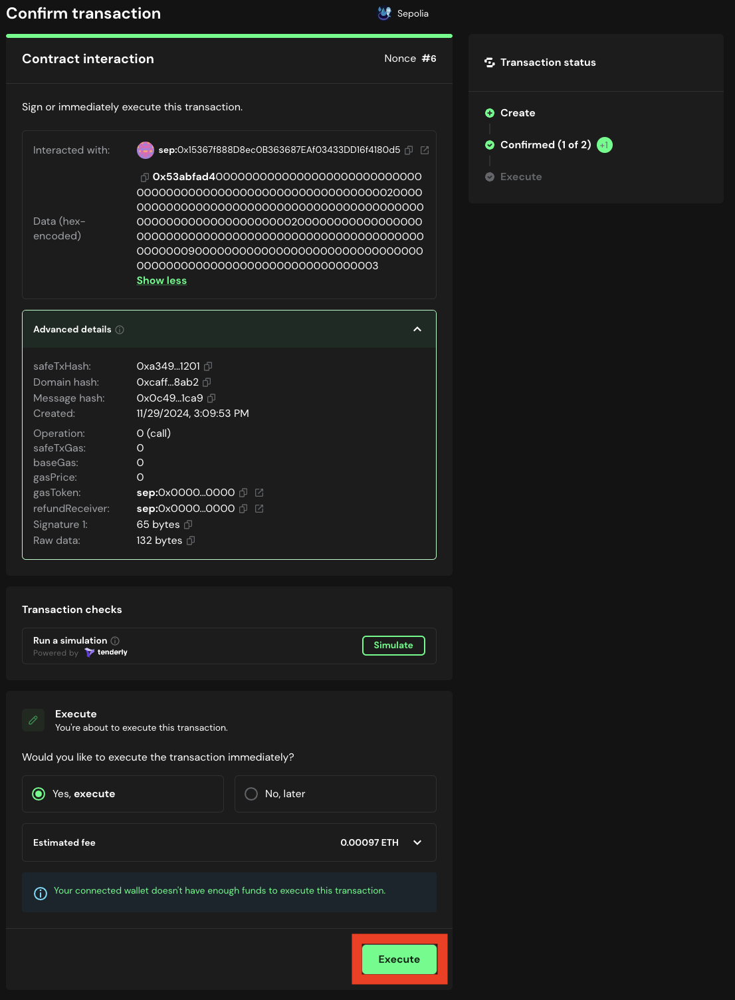

# Approve the Remove Operator Transaction

Once the transaction is proposed, the multisig owners must approve the transaction.

## Approve the Remove Operator for registryCoordinator

#### 1. Go to [Safe](https://app.safe.global/home) and connect your wallet.

#### 2. Go to the `Transactions` tab and find the transaction that was proposed.

#### 3. Get the ```remove_multiple(address[])``` signature by running:
   
   ```bash
   cast calldata "remove_multiple(address[])" "[<OPERATOR_ADDRESS>, ...]"
   ```
   
   For example:
   ```bash
   cast calldata "remove_multiple(address[])" "[0x0000000000000000000000000000000000000009, 0x0000000000000000000000000000000000000003]"
   ```
   will display ```0x53abfad40000000000000000000000000000000000000000000000000000000000000020000000000000000000000000000000000000000000000000000000000000000200000000000000000000000000000000000000000000000000000000000000090000000000000000000000000000000000000000000000000000000000000003```

   Confirm the calldata starts with the correct function identifier ```0x53abfad4```.
   
#### 4. Click on the transaction, and then click on ```Advanced Details```.

    

#### 5. Copy the ```Raw Data```, paste it in a text editor and verify it is the same value as the one you got in step 3.

#### 6. If the data is correct, click on the `Confirm` button.

#### 7. Simulate the transaction. If everything is correct, click on the `Sign` or `Execute` (if you are the last signer) button.

   

#### 8. Once the transaction is executed, the operator will be removed within the `registryCoordinator` contract.