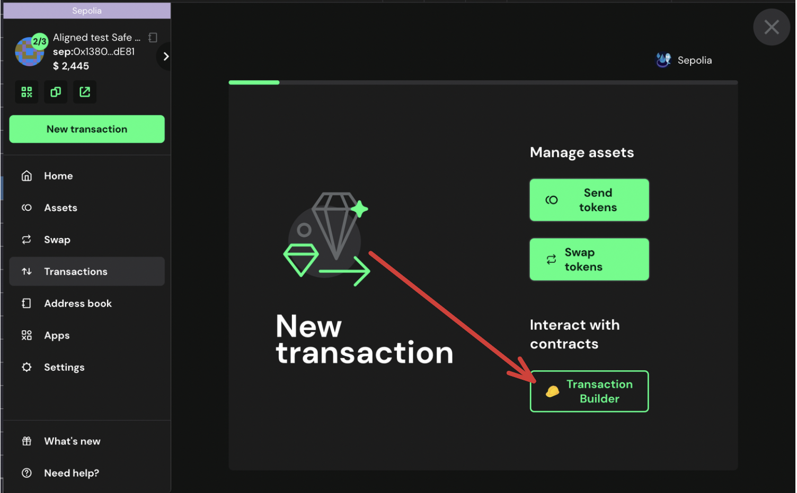
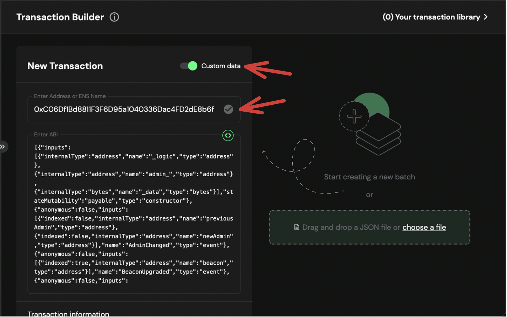
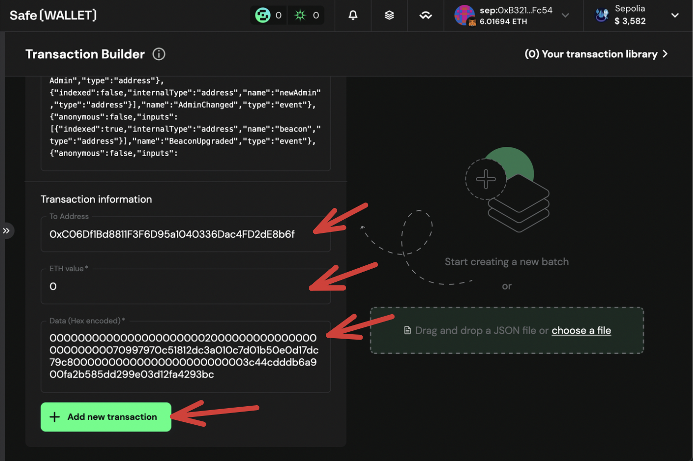
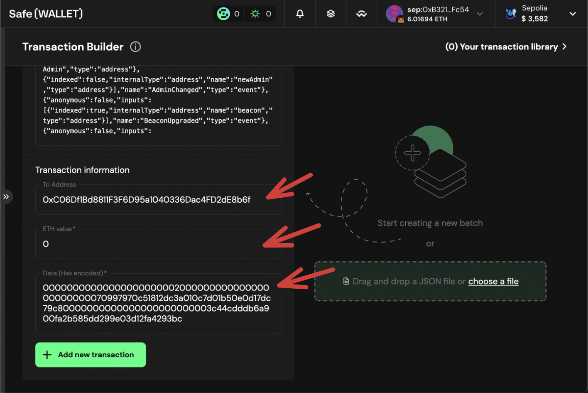

# Propose the Transaction for Modify Strategy Weight Multipliers using Multisig

If you want to modify the Strategy Weight Multipliers the contracts, you can propose the transaction using the multisig wallet.

## Prerequisites

- You need to have deployed the contracts following the [Deploy Contracts Guide](./2_deploy_contracts.md).

## Propose transaction for Pause AlignedLayerServiceManager

To propose the modify Strategy Weight Multipliers transaction you can follow the steps below:

1. Go to [Safe](https://app.safe.global/home)

2. Click on `New transaction` -> `Transaction Builder`

   

   

3. . Get the `StakeRegistry` address from ```contracts/script/output/mainnet/alignedlayer_deployment_output.json``` or ```contracts/script/output/holesky/alignedlayer_deployment_output.json``` or ```contracts/script/output/sepolia/alignedlayer_deployment_output.json```

4. Paste the `StakeRegistry` address on `Enter Address or ENS Name`

TODO pic

5. As this is a Proxy contract, choose `Use Implementation ABI`



6. In `contract method selector` choose `modifyStrategyParams` , and fill in the parameter values accordingly. 

Note: Aligned currently only has `quorumNumber: 0`, and you will replace `strategyIndices` with `newMultipliers`



7. Click on `+ Add new transaction`

   You should see the new transaction to be executed

8. Click on `Create batch` to create the transaction.

9. Simulate the transaction by clicking on `Simulate`

10. If everything is correct, click on `Send batch` to send the transaction.

11. Simulate the transaction, and if everything is correct, click on `Sign`.



> [!NOTE]
> In the `call` field, you will see `fallback`.

12. Wait for the transaction to be executed. You can check the transaction status on the `Transactions` tab.

If the transaction is correctly created, you have to wait until the required Multisig member signs the transaction to send it. For this, you can follow [the following guide](./4_b_2_approve_pause.md)
