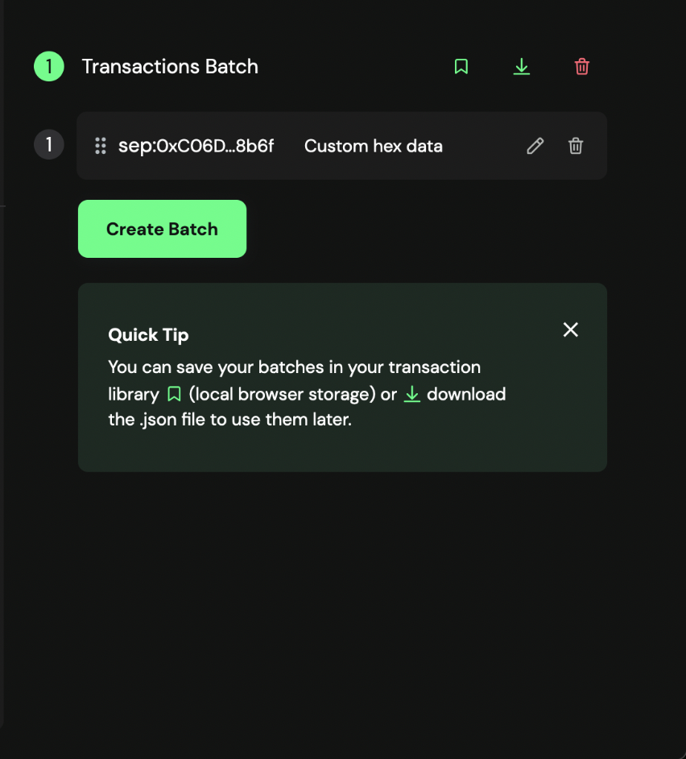
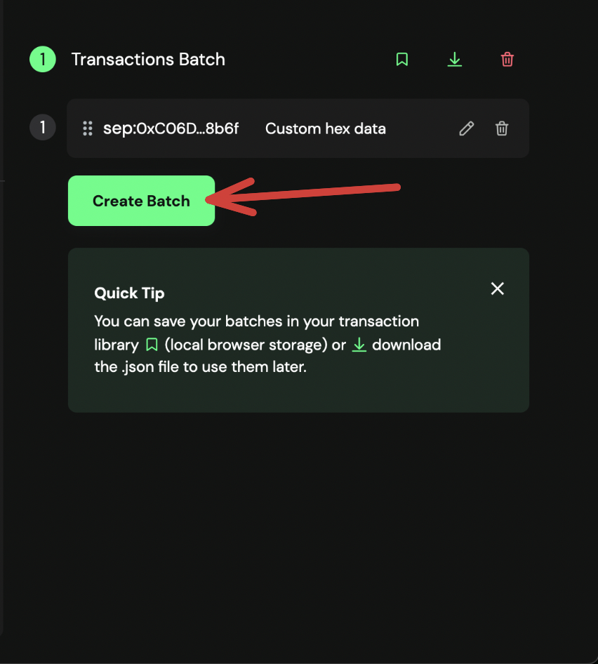

# Approve the  Modify Strategy Weight Multipliers Transaction

Once the transaction is proposed, the multisig owners must approve the transaction.

## Approve the Pause for AlignedLayerServiceManager

1. Go to [Safe](https://app.safe.global/home) and connect your wallet.

2. Go to the `Transactions` tab and find the transaction that was proposed.

3. Get the ```modifyStrategyParams()()``` signature by running:
   
   ```bash
   cast calldata "modifyStrategyParams(uint8,uint256[],uint96[])()" <quorum_number> <[strategyIndices]> <[newMultipliers]>
   ```

   for example:

   ```bash
   cast calldata "modifyStrategyParams(uint8,uint256[],uint96[])()" 0 "[0]" "[123456]"
   ```
   
   It must show you ```0x20b66298...```.
   
4. Click on the transaction, and then click on ```Advanced Details```.



5. Copy the ```Raw Data```, paste it in a text editor and verify it is the same value as the one you got in step 3.

6. If the data is correct, click on the `Confirm` button.

7. Simulate the transaction. If everything is correct, click on the `Sign` button, or `Execute` if you are the last signer.



8. Once the transaction is executed, the modification will be effective.
