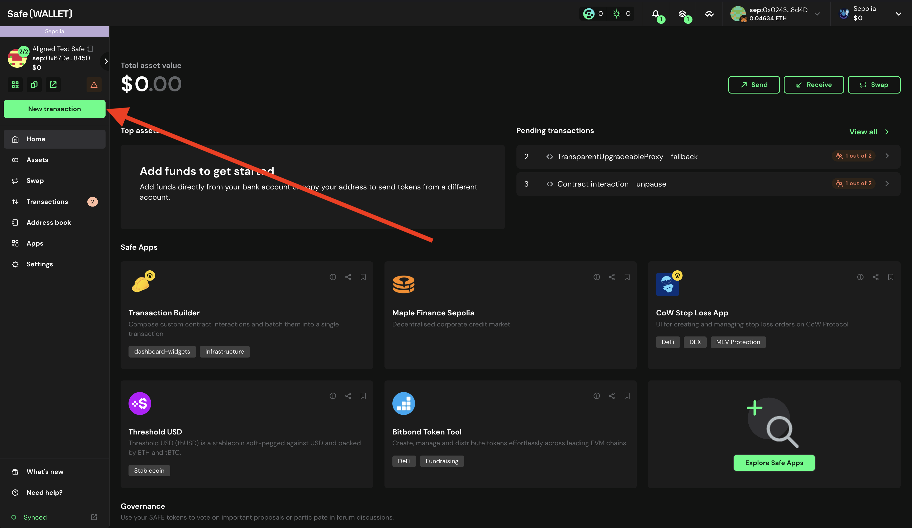
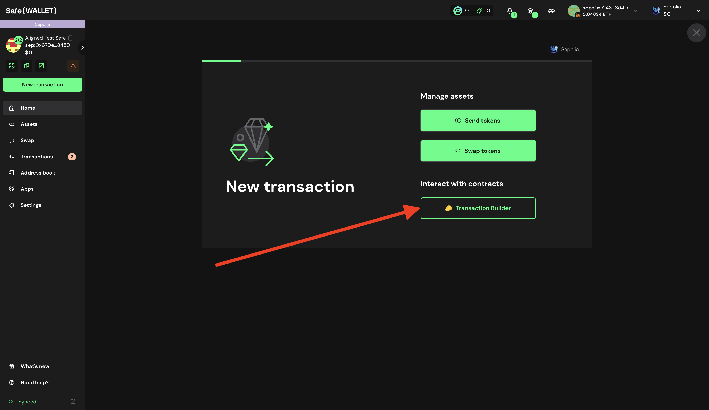
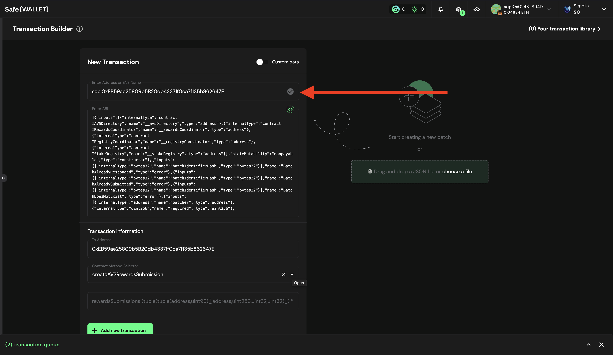
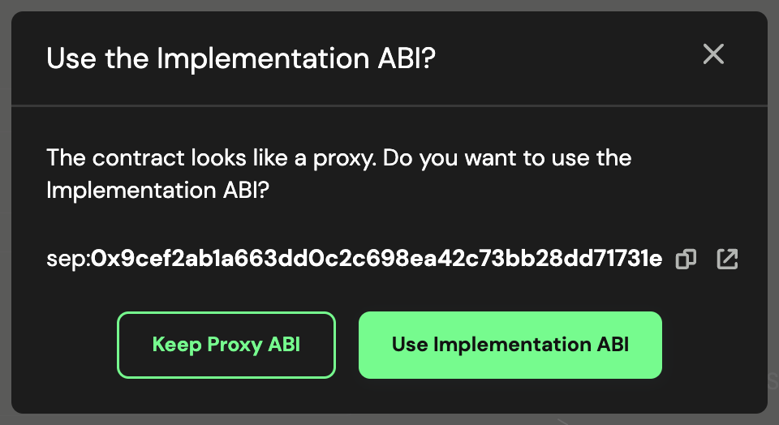
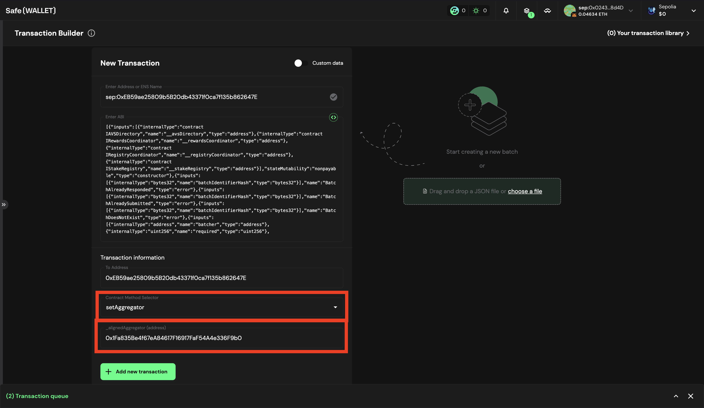
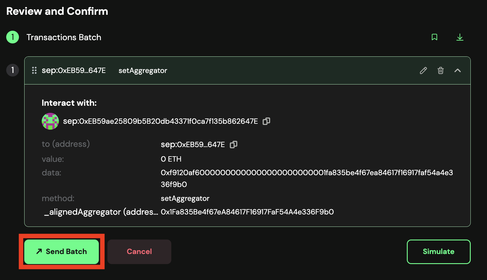
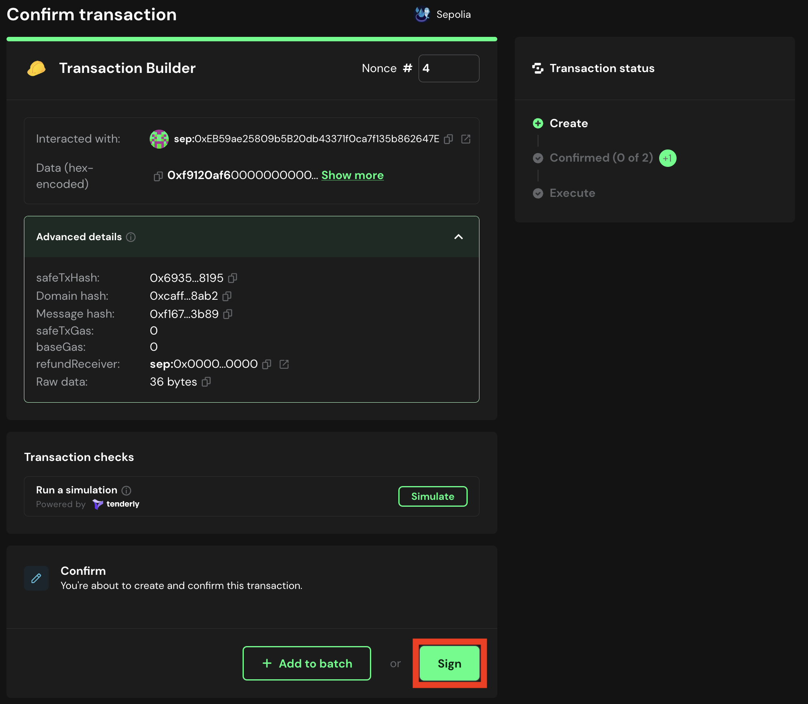

# Propose the Transaction for Setting Aggregator Address using Multisig

If you want to set the Aggregator Address, you can propose the set Aggregator Address transaction using the multisig wallet.

## Prerequisites

- You need to have deployed the contracts following the [Deploy Contracts Guide](./2_deploy_contracts.md).

## Propose transaction for Set Aggregator Address

To propose the set aggregator address transaction you can follow the steps below:

#### 1. Go to [Safe](https://app.safe.global/home)

#### 2. Click on `New transaction` -> `Transaction Builder`

   

   

#### 3. Get the `AlignedLayerServiceManager` address from ```contracts/script/output/mainnet/alignedlayer_deployment_output.json``` or ```contracts/script/output/holesky/alignedlayer_deployment_output.json``` or ```contracts/script/output/sepolia/alignedlayer_deployment_output.json```

#### 4. Paste the `AlignedLayerServiceManager` address on `Enter Address or ENS Name`

   

#### 5. As this is a Proxy contract, choose `Use Implementation ABI`

   

#### 6. In `contract method selector` choose `setAggregator()` and within `_alignedAggregator(address)` enter the ethereum new address of the aggregator.

   

#### 7. Click on `+ Add new transaction`

   You should see the new transaction to be executed

#### 8. Click on `Create batch` to create the transaction.

   

#### 9. Simulate the transaction by clicking on `Simulate`

#### 10. If everything is correct, click on `Send batch` to send the transaction.
   
   

#### 11. Simulate the transaction, and if everything is correct, click on `Sign`.

   

> [!NOTE]
> In the `call` field, you will see `fallback`.
#### 12. Wait for the transaction to be executed. You can check the transaction status on the `Transactions` tab.

#### 13. Verify the Aligned Aggreagtor Address has changed
```
cast call --rpc-url <RPC_URL> $ALIGNED_SERVICE_MANAGER_ADDRESS "alignedAggregator()(address)" 
```

You should observe that the printed address matches the address in `AGGREGATOR_ADDRESS`.
