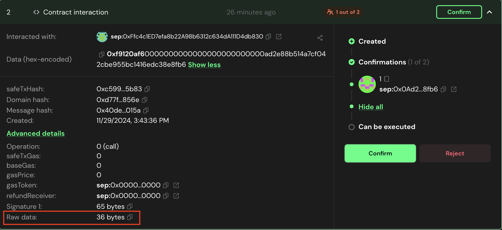
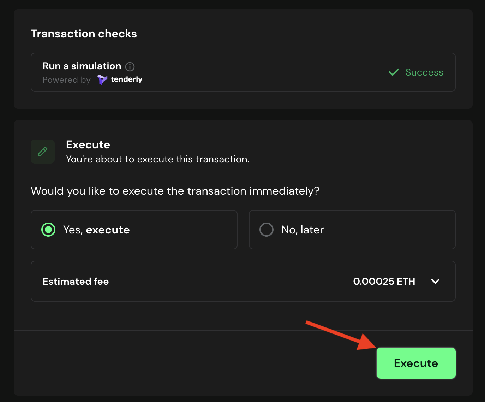

# Approve the Set Aggregator Address Transaction

Once the transaction is proposed, the multisig owners must approve the transaction.

## Approve the new Address for the Aggregator

### 1. Go to [Safe](https://app.safe.global/home) and connect your wallet.

### 2. Go to the `Transactions` tab and find the transaction that was proposed.

### 3. Get the expected raw data by running by running:
   
```bash
cast calldata "setAggregator(address)()" <NEW_AGGREGATOR_ADDRESS>
```
   
### 4. Click on the transaction, and then click on ```Advanced Details```.

    

### 5. Copy the ```Raw Data```, paste it in a text editor and verify it is the same value as the one you got in step 3.

### 6. If the data is correct, click on the `Confirm` button.

### 7. Simulate the transaction. If everything is correct, click on the `Sign` button (or `Execute`, if you are the last one signing the transaction).

   

### 8. Once the transaction is executed, the change will be effective.
