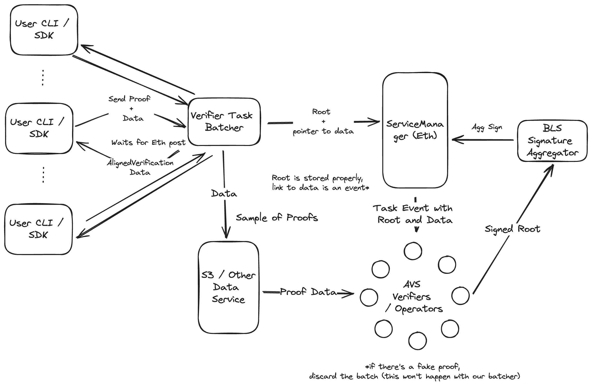
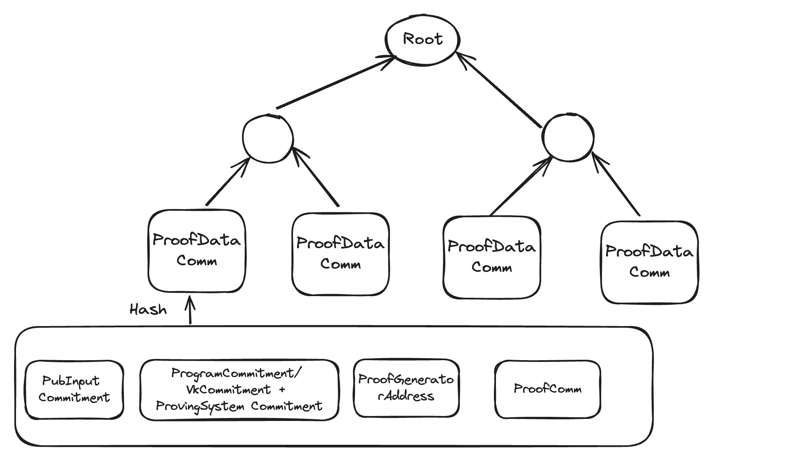

## Fast mode in a nutshell

The fast mode works using a subset of Ethereum’s validators via restaking.
Validators (also called Operators) receive proofs, verify them using the verification code written in Rust or another
higher-level language, and sign messages with BLS signatures.
If a two-thirds majority agrees, the results are posted to Ethereum.

## Simplified Architecture

The proof submission can be simplified as follows:



1. The users submit proofs to the batcher through the CLI or SDK.
2. The batcher accumulates proofs, and then sends the batch to the Data Service and posts the merkle root and data to
   Ethereum.
3. The operators download the proofs from the Data Service, verify them, and sign the results.
4. The BLS signature aggregator accumulates the signed responses until reaching the quorum, then sends the aggregated
   signature to Ethereum.
5. The users can read the results from Ethereum.

## Architecture

Aligned’s architecture is shown in the figure below:


The validators/AVS operators are the ones responsible for proof verification.
They fetch the proof data from the data service and verify it using the different proving systems supported by Aligned.

### What happens when sending a proof and publishing the result on Ethereum?

The flow for sending a proof and having the results on Ethereum is as follows:

1. The user uses a provided CLI or SDK to send one or many proofs to the batcher, and waits.
2. The batcher answers with a ValidityResponse for each proof (if proof, nonce and signature are valid).
3. The batcher answers with a BatchInclusionData for each proof.
4. The user invokes the VerifyBatchInclusion function in the ServiceManager contract with this data to check that the
   proof has been verified in Aligned and is included in the batch.
5. Then, it is checked that the commitment of the proven program matches the expected one.

### Full flow with internals of the proof

1. The user uses a provided CLI or SDK to send one or more proofs to the batcher, and waits (Alternatively, the user can
   run a batcher or interact directly with Ethereum).
2. The batcher accumulates proofs of many users for a small number of blocks (typically 1–3).
3. The batcher creates a Merkle Tree with commitments of all the data submitted by users, uploads the proofs to the Data
   Service,
   and submits it to the [Batcher Payment Service](./components/2_payment_service_contract.md)
4. The Batcher Payment Service rebuilds the merkle tree, and then verifies user signatures and nonce's.
5. The Batcher Payment Service sends the batch to
   the [Aligned Service Manager](./components/3_service_manager_contract.md).
6. The operators, using the data in Ethereum, download the proofs from the DataService.
   They then verify that the Merkle root is equal to the one in Ethereum, and verifies all the proofs.
7. If the proofs are valid, they sign the root and send this to the BLS signature aggregator.
8. The signature aggregator accumulates the signed responses until reaching the quorum, then sends the aggregated
   signature to Ethereum.
9. Ethereum verifies the aggregated signatures and changes the state of the batch from pending to verified.

### Batch structure

The task batch consists of a Merkle tree containing the relevant information for proof verification in the lower level
leaves.
The root of the Merkle tree is posted to Ethereum together with a pointer to where the data is stored.
Each leaf contains the following information:

- A commitment to the public input of the proof.
- A commitment to the proof and information about the proof system.
- A commitment to the program or a commitment to the verification key (depending on the proof system used).
- The address of the proof’s generator/submitter (optional).

A diagram for the batch is shown on the figure below:



### Reading the results from Ethereum

Once the results from a batch have been checked on Ethereum, the Aligned contract is updated with the results.
The user’s contract can query the Aligned contract to check whether the proof has been included in a successful batch.

Additionally, the contract needs to be set to receive only proofs of specific programs.
For example, in an L2, this may be a specific program that represents the state transition of the blockchain.
In the contract, the pseudocode would look like this:

```Plain Text
is_verified = VerifyWithAlignedVerificationData(
   AlignedVerificationData
)
require(is_verified)
require(ProofVerificationData.ProgramComm ==...)
```

Optionally, a committed address can also be used,
an example being if one wants to give an NFT or tokens to a user that submitted a proof.
Depending on the application, it may be needed or not.

## Entities

Aligned has the following entities:


All entities are described in the next sections.
